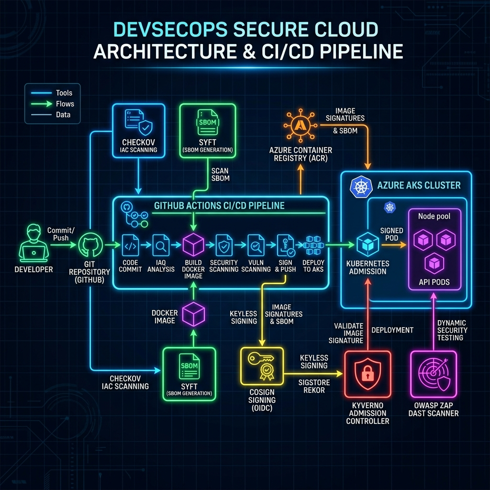

# 🛡️ CERBERUS Infrastructure & Application Threat Model (STRIDE Framework)

## 📐 Architecture Diagram & Attack Boundaries

---

## 📌 1. Vue d'Ensemble & Frontières de Confiance (Trust Boundaries)

L'architecture **CERBERUS** comprend 3 frontières de confiance majeures :
1. **Frontière 1 (Internet / Client externe)** → Traitement du trafic entrant HTTP (Exposition Service/Ingress).
2. **Frontière 2 (Cluster Kubernetes / Admission Control)** → Ingestion et déploiement de pods (Kyverno Webhook Engine).
3. **Frontière 3 (Infrastructure Cloud Azure / Registre OCI)** → Stockage des artefacts Terraform & ACR.

---

## 📊 2. Matrice d'Analyse des Menaces STRIDE

| Menace STRIDE | Risque / Attaque Potentielle | Contre-Mesure DevSecOps Appliquée dans CERBERUS | Statut dans le Périmètre Testé |
| :--- | :--- | :--- | :--- |
| **S - Spoofing** *(Usurpation)* | Un Pod non autorisé usurpe l'identité d'un service légitime ou tente d'accéder au Registre ACR. | - Authentification Zero-Trust Azure Managed Identity / RBAC. - Isolation réseau via Kubernetes `NetworkPolicy` (Zero-Trust ingress/egress). | 🟢 **Mitigé** |
| **T - Tampering** *(Altération)* | Un attaquant modifie l'image Docker dans la Supply Chain ou injecte un paquet malveillant dans le conteneur. | - Génération automatique du **SBOM** (`syft`) au format SPDX. - Signature cryptographique obligatoire des artefacts avec **Cosign** (`Verified OK`). | 🟢 **Mitigé** |
| **R - Repudiation** *(Déni d'actions)* | Un utilisateur ou un conteneur effectue des actions malveillantes sans trace d'audit. | - Journalisation structurée JSON des événements HTTP (Express/Winston). - Sonde de santé K8s (`/health`) et audits d'admission Kyverno loggés. | 🟢 **Mitigé** |
| **I - Information Disclosure** *(Fuite d'informations)* | Révélation de la version du serveur (`X-Powered-By`) ou fuite de stack trace sur des erreurs 404/500. | - Suppression automatique de `X-Powered-By` dans Express. - En-têtes HTTP de sécurité appliqués via **Helmet** (Clickjacking, nosniff, CSP). - Audit DAST OWASP ZAP Baseline validé sans alerte élevée dans le périmètre testé. | 🟢 **Mitigé** |
| **D - Denial of Service** *(Déni de Service)* | Un conteneur épuise la RAM ou le CPU du nœud K8s (OOM-Killed) ou subit une surcharge de payload JSON. | - Limites strictes de ressources dans `k8s/deployement.yaml` (`requests: 64Mi/100m`, `limits: 128Mi/250m`). - Limitation de la taille des payloads JSON à 10 KB (`express.json({ limit: '10kb' })`). | 🟢 **Mitigé** |
| **E - Elevation of Privilege** *(Élévation de privilèges)* | Un conteneur compromis s'exécute en `root` (UID 0) et tente une évasion vers l'hôte Linux (Kernel breakout). | - Politique d'Admission **Kyverno** bloquante (`disallow-root-user` en mode `Enforce`). - Execution en compte non-root `UID 10001` (`runAsNonRoot: true`). - Suppression de toutes les capacités Linux (`capabilities: drop: [ALL]`). - Système de fichiers racine en lecture seule (`readOnlyRootFilesystem: true`). | 🟢 **Mitigé** |

---

## 📜 3. Référentiels de Conformité Respectés
- **NIST SP 800-190** : *Application Container Security Guide*.
- **CIS Kubernetes Benchmark** : Section 5 - *Pod Security Standards*.
- **OWASP Top 10 API Security** : Validation dynamique DAST.
